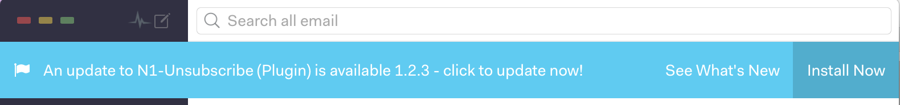
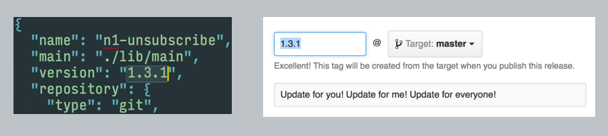

# n1pluginupdater

Alerts users that an updated plugin has been released using the N1 official notification bar!



## How to Install

1. Add this npm module: `npm install n1pluginupdater --save`

2. Require the package.json information and this module (Somewhere at the top of your `main.jsx` file):
  ```jsx
  const config = require(`${__dirname}/../package.json`); # or whatever the path to package.json is
  const n1pluginupdater = require('n1pluginupdater');
  ```

3. Initialize the updater in the `activate` block of `main.jsx`:
  ```jsx
  activate: () => {
    n1pluginupdater.checkForUpdate({
      repositoryName: "your_Github_Repository_Name",
      repositoryOwner: "your_Github_Username",
      currentVersion: config.version,
    });
    # Other code...etc.
  },
  ```
  
3. **OPTIONAL**: *BREAK IT* and test it out. Try hardcoding values you know won't work and see the notification appear after refreshing Nylas:
  ```jsx
  activate: () => {
    n1pluginupdater.checkForUpdate({
      repositoryName: "n1-unsubscribe",
      repositoryOwner: "colinking",
      currentVersion: "1.3.0",
    });
    # Other code...etc.
  },
  ```

## The Fine Print

To use this package you need to be specific about making releases. The version number in the package.json needs to match the tag you use on the release.



